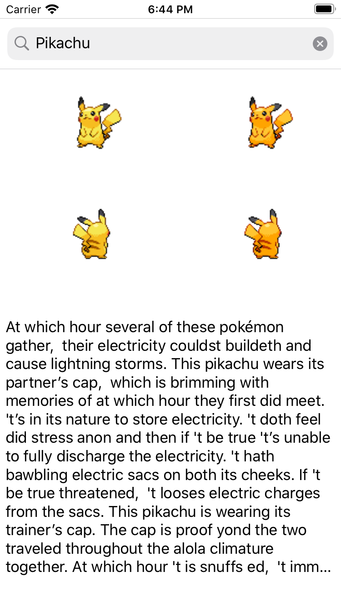

# Pokemon To Shakespearean Kit
## This kit provide 3 functions intergrate <strong> PokéAPI </strong> and <strong>Shakespeare translator API</strong>
<br>



<br>

### Search pokemon's English description with name
```swift
public func getPokemonEnglishDescription(with name: String, callback: @escaping ((String)->())) 
```

### Search pokemon's English description with name and translated it to Shakespeare style
```swift
public func getShakespeareanDescription(with name: String, callback:@escaping ((String)->()))
```

### Search pokemon's sprites(images) with name
```swift
public func getPokemonSprites(with name: String, callback: @escaping ((PokemonResource?)->()))
```
### There will be 8 images url in the PokemonResource.sprites
<br>

# Install
Clone the repository and open PokemonToShakespeareanKit.xcodeproj
and command + b build. <br>
There will build a PokemonToShakespeareanKit.framework for ios. <br>
Add this framework to your project. <br>
Then import PokemonToShakespeareanKit to your code <br> 
```swift
import PokemonToShakespeareanKit
```
Then use the functions. For example
```swift
getShakespeareanDescription(with: name) {[weak self] (description) in
                guard let self = self else {return}
                DispatchQueue.main.async {
                    self.label.text = description
                }
            }
            
```

```swift
getPokemonSprites(with: name) {[weak self] (result) in
                guard let self = self else {return}
                if let pokemon = result {
                    DispatchQueue.main.async {
                        
                        self.imageView1.downloaded(from: pokemon.sprites.frontDefault)
                        self.imageView2.downloaded(from: pokemon.sprites.backDefault)
                        self.imageView3.downloaded(from: pokemon.sprites.frontShiny)
                        self.imageView4.downloaded(from: pokemon.sprites.backShiny)
                    }
                }
            }
```
Take a look at the full example in PokemonToShakespeareanApp.<br>
Open PokemonToShackspeare.xcworkspace. <br>
Select PokemonToShakespeareanApp scheme. <br>
Command + r run the app.

<br>

# Tests
Open PokemonToShakespeareanKit.xcodeproj
and command + u start test. <br>
Tests will pass in first 5 times. <br>
When achieve Shakespeare translator API request limied. 5 request / hour.
Tests will fail. (lol)

## Don't forget <strong> PokéAPI </strong> api only accept lowercases
```swift
let name = text.lowercased()
```
